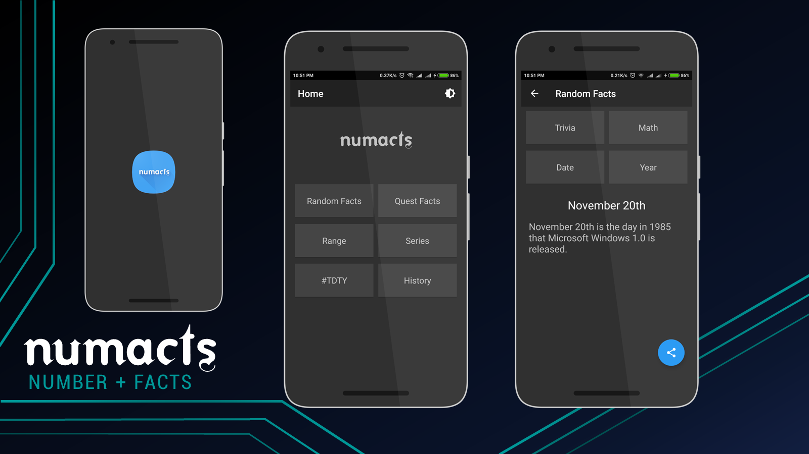

# NumactsAppathon

I created this app for [Techgig Appathon Season 2](https://www.techgig.com/challenge/appathon2#winners) and got 2nd prize

Download [APK](https://github.com/mddanishansari/NumactsAppathon/blob/master/app/app-debug.apk?raw=true). Show some love and press :star:

Made with :heart: in India

#### Note: The code is as it is except for configuration files like gradle files etc.
